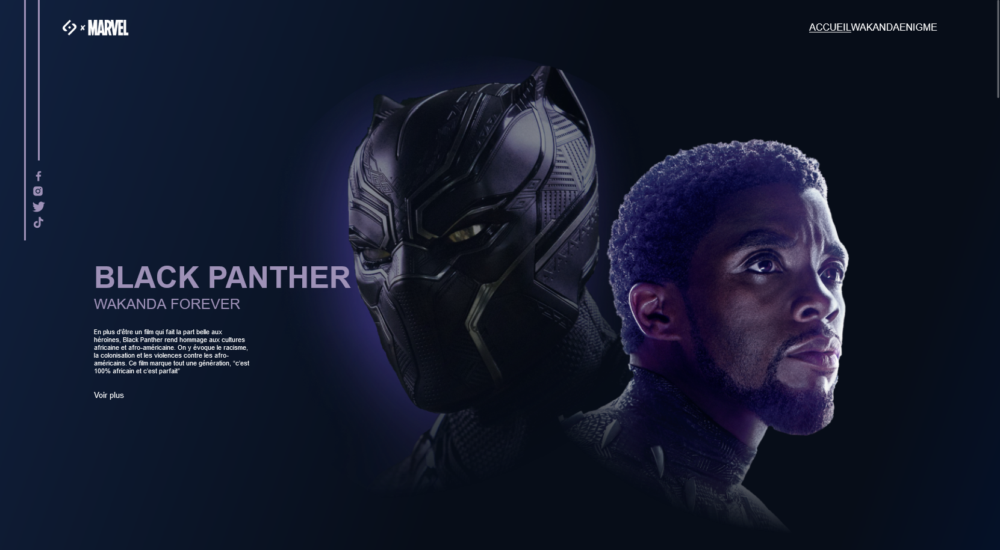
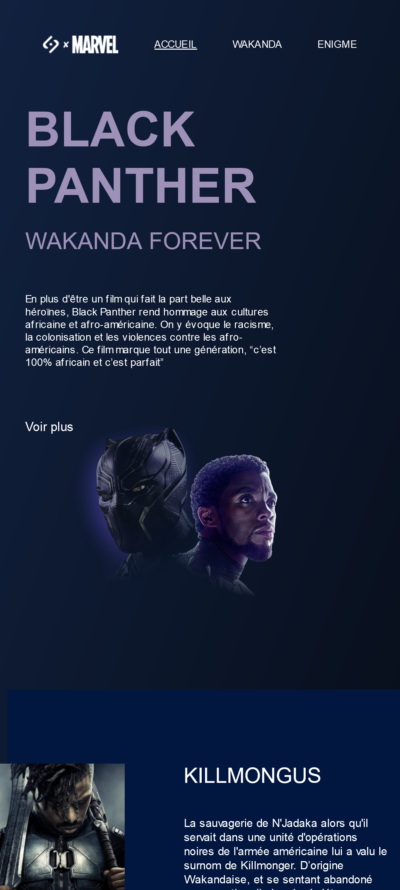

# Batman 
**Project Description**   
This is my first project I made a long time ago who is dedicated to Batman, it is written in vanilla HTML, CSS, JS. It is talking  everything (storybook, moovies, FAQ) about Batman and in additon you can test your fan skills with quizz  
  
>  Preview it [here](https://Annaick.github.io/batman)
  
## Table of contents 
- [Overview](#overview)
    - [Screenshot](#screenshot)
    - [Preview](#preview)
    - [Built with](#built-with)
- [Author](#author)
----  
## Overview  
At a time I didn't knom about Framework and other build tools, I just managed to get a working app with pure JS, HTML and CSS. T
### Screenshot

*Desktop*  

*Mobile* 

### Preview
- Live Site: Click [here](https://Annaick.github.io/batman)  

###  Built with
- [Vite](https://vitejs.dev) as Build tool
- [npm](https://npmjs.com) as package manager
- Framework [React](https://reacjs.org)
----
## Author
- LinkendIn: Click [here](https://www.linkedin.com/in/tiana-anna%C3%AFck-b21914285?utm_source=share&utm_campaign=share_via&utm_content=profile&utm_medium=android_app
)
- Email: annaick.tiana@gmail.com
